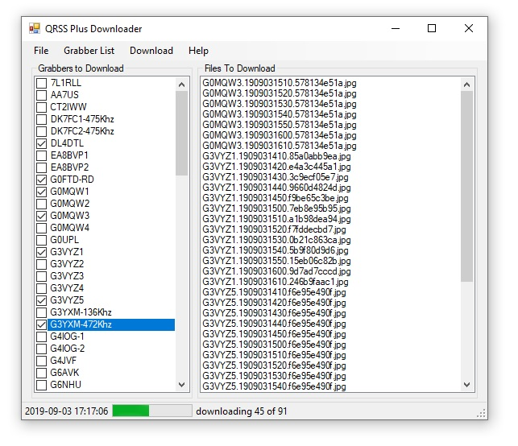

The **QRSS Plus Downloader** is a Windows application which makes it easy to automatically download QRSS grabber images from the [QRSS Plus website](http://swharden.com/qrss/plus/).

## Features
* Automatic grabber detection (grabbers are pulled from QRSS Plus website)
* Downloaded files are organized info folders according to callsign
* Automatically download new grabs every every 10 minutes
* Select only the callsigns you wish to download

## Download

  
Download

	<a class="btn btn-primary btn-lg" href="downloads/QrssPlusDownloader-1.3.zip">
		<svg xmlns="http://www.w3.org/2000/svg" width="32" height="32" fill="currentColor" class="bi bi-exclamation-circle me-3" viewBox="0 0 16 16">
		<path d="M.5 9.9a.5.5 0 0 1 .5.5v2.5a1 1 0 0 0 1 1h12a1 1 0 0 0 1-1v-2.5a.5.5 0 0 1 1 0v2.5a2 2 0 0 1-2 2H2a2 2 0 0 1-2-2v-2.5a.5.5 0 0 1 .5-.5z"></path>
		<path d="M7.646 11.854a.5.5 0 0 0 .708 0l3-3a.5.5 0 0 0-.708-.708L8.5 10.293V1.5a.5.5 0 0 0-1 0v8.793L5.354 8.146a.5.5 0 1 0-.708.708l3 3z"></path>
		</svg>QRSS Plus Downloader 1.3
	</a>
  

## Source Code

* GitHub: [swharden/QRSSplus-Downloader](https://github.com/swharden/QRSSplus-Downloader)

### Changelog

* Version 1.3 (2021-02-13)
  * Target .NET Framework 4.6.1 (previously 4.5)
  * Add SSL support
* Version 1.2 (2019-09-04)
  * Don't download images whose hash is already seen. This prevents the downloading duplicate images from inactive grabbers.
  * Default save file is now "grabber.txt" (not "graber.txt").
  * If "grabber.txt" exists in the same folder as the EXE, it is loaded when the program starts.
* Version 1.1 (2019-09-03)
  * Ignore exceptions during the download sequence. This was done so to prevent a hard crash if the user temporarily loses internet or the server doesn't respond.
* Version 1.0 (2019-09-02)
  * Initial Release (fully functional)
